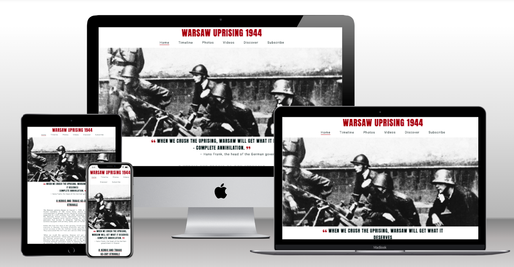
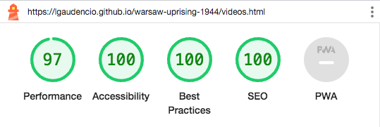
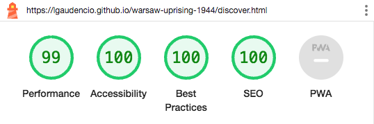

# Warsaw Uprising 1944

Warsaw Uprising 1944 is a website that will allow users to learn about the 63-day struggle of the Polish people during 1st August to 2nd October 1944, which formed a part of Operation Tempest during World War 2. The website is designed to show the user the raw and emotional side of the uprising through quotes, images and videos. It will be mainly aimed at history students and all history lovers. The live site can be viewed [here](https://lgaudencio.github.io/warsaw-uprising-1944/)

## Features 

### Site Wide

* Navigation Menu 
    * Contains links to the Home, Timeline, Photos, Videos, Discover and Subscribe and it will be responsive on all devices.
    * It will allow users to navigate easily between all the pages on the website and they will be able to view them on the device of their choice.

  

* Footer
    * This will contain a clickable link that will take users back to the top of the page, thus omitting the need to scroll back up. The second part of the footer will include social media links so that the users will be able to follow us across social media platforms. By clicking the social media icons, they will open in a new tab. The icons will also be accessible to visually impaired users who might be using a screen reader, by the use of aria labels.
    * This will allow the user to follow us for more history content updates across any social media platform they use. 

  

* Favicon 
    * A favicon icon will show up on all pages that are opened across the website, which will allow the user to identify the website if they happen to have a few tabs opened on their browser. 
    * The favicon implemented is the symbol of the Home Army, which has a background of the Polish flag and an anchor symbol called the ‘Kotwica’.

  

* 404 Page 
    * A 404 page is implemented and will only display if the user navigates to a broken link. 
    * If the user comes across the 404 page, there will be a link which will take them back to the Home page without having to use the back button on the brower. The logo on top of the page will also guide the user back to the Home page. 

  

### Landing Page

* Landing Page Image 
    * This will be a black and white photo of soldiers, in uniform, and with weapons out. 
    * This image will immediately show a user that the website is related to some sort of war/historical event. 

* Main Quote
    * The quote is take from the head of the German government in Poland, this quote was put there to grab attention from anyone who came across the landing site. It’s meant to be powerful and eye grabbing. 
    * This quote will also tell users that it is linked to WW2.

    

* Summary 
    * A summary of the Warsaw Uprising is added to describe when it happened, why it happened, what happened and what became the outcome of those 63 days in Warsaw.
    * This information was added so the user will be able to read it and have a basic understanding of what the Warsaw Uprising was about, what it achieved and what happened after it ended. 

    

* Witnesses of Terror (More Quotes) 
    * This will have four quotes from the people of Warsaw that lived through the uprising and of those who fought for their freedom. 
    * This information was added so the user will understand what the Poles had to do to defeat their occupier and what consequences that would eventually have.

    

### Timeline Page

* Timeline
    * The timeline page will provide the user with a more detailed description of the main key dates of the Warsaw Uprising. This page will be fully responsive on all devices.
    * This information was added so the user will have more of an understanding of what happened on certain key dates to build a mental image of the chronological order of events. 

    

### Photos Page

* Photos 
    * The photos page will provide the user will a series of images that were taken throughout those 63-days of the uprising. 
    * This was added for those that like a visual aspect to their learning, as they say, a picture is worth a throusand words. 

    

### Videos Page

* Videos 
    * This page will have three videos for the user if they want a more visual approach to learning about the Warsaw Uprising. 
    * The user has control over the controls, so they have to press ‘play’ for the video to start, they can click pause and control the volume settings. 
    * This information was added so the user can learn more in detail and the last video is a documentary with people who lived through the Warsaw Uprising, so it links into the Witnesses of Terror section on the landing page. 

    

### Discover Page

* Discover 
    * The discover page will allow the user to know where the Warsaw Uprising museum is located. There is information such as the address, opening times and a link to the website.
    * A Google Map API was also add so the user can look around and plan their route, they can also click to expand the map and it will open in a new tab.  
    * This information was added so the user can plan their visit if they wish.

    

### Subscribe Page 

* Subscribe 
    * A subscribe form is implemented to allow users to subscribe for more content. The form will consist of the following fields and attributes: 
        * First Name (required, type=text)
        * Last Name (required, type=text)
        * Email (required, type=email)
    * If the submission of the form is successful, the user will be sent to the thank-you.html, which will display a thank you message confirming the details have been received. 
    * This will allow the user to subscribe to us for more history content and get updates to future content via email. 

    

    

    ### Existing Features 

    * Responsive design
    * Google map interaction 
    * Interactive videos 
    * Contact form, which then directs the user to a success page 

    ### Features left to Implement 

    * A feature that could be implemented in the future, would be to add JavaScript so that an email can be sent to us with the users contact details. 

    ## Technologies 

    * HTML 
        * HTML was used as the main language to develop the structure of the website. 

    * CSS 
        * Custom CSS was used to style the website and it exists in an external file. 
    
    * GitHub 
        * GitHub IDE was used the develop the website. 
        * GitHub is used to host the source code and it is deployed using Git Pages. 

    * Git
        * Git is used to commit and push code during the development of the website. 

    * Font Awesome 
        * Icons used in this website can be found on (https://fontawesome.com/). Icons used were arrows for 'back to top' link and the social media links, both of which can be found on the footer of the website. Icons were also used as the open and close speech marks used on the quotes found on the landing page. 

    * Favicon 
        * The favicon used was created at (https://favicon.io/).

## Testing

### Responsiveness 

During the styling phase for media queries, all pages were tested to ensure responsiveness on screen sizes from 280px and upwards. All pages were tested on Chrome, Safari and Edge browsers. 

Steps to test: 

1. Open a browser and go to [Website](https://lgaudencio.github.io/warsaw-uprising-1944/)
2. Right click on page and select 'Inspect', this will open up developer tools. 
3. Decrease the screen size to 280px. 
4. Click and drag the responsive window to set the width for testing.

Expected: 

Website is to be responsive on all screen sizes and no images are to be pixalated or distorted due to stretching. No horizonal scroll appears on mobile devices and nothing overlaps. 

Actual: 

Website behaved as expected, the exception to this was for very wide screens. The main image starts to repeat itself, therefore, it was centered to keep it tidy even with image reoccurance. Further details can be found later on in the Unfixed Bugs section. 

The website was tested for its responsiveness on the following devices and no issues were observed: 

* Samsung Galaxy Fold
* iPhone 12 Pro
* iPad Air
* Surface Duo 
* Nexus 10

### Accessibility 

Accessibility was thought about throughout the development and testing of the website, therefore, only four colours are used throughout the entire website. By using [coolors.co](https://coolors.co/) the colours used are: 

* #040F0F - Black
* #FFFFFF - White
* #9B1D20 - Red
* #818D92 - Grey

Testing was focused so that the following could be ensured: 

* Heading levels are not skipped or missed, thus ensuring the importance of the content to the user. 
* HTML page has the lang attribute. 
* Alt attributes have been given to all images used in the website. 
* The form used to subscribe has associated labels or aria-labels, so that it can be read out to users who use screen readers. 
* Aria properties have been implemented correctly. 

### Lighthouse Testing 

    

### Functional Testing 

**Navigation Links** 

Testing was conducted on all navigation links on all pages to ensure that the corresponding page opens. This was accomplished by clicking on each of the navigation links on each page. Navigation Link (Page Opened):

* Home (index.html)
* Timeline (timeline.html)
* Photos (photos.html)
* Videos (videos.html)
* Discover (discover.html)
* Subscribe (subscribe.html)

Links on all pages navigated to the correct pages as expected.

**Footer - Back to Top Link**

Testing was performed on the ‘Back to Top’ link at the footer of the website. It was done by clicking the link on each page and ensuring that the page was brought back to the top to save the user from scrolling up to the navigation bar.
    
The link on each page performed as expected. 

**Footer Social Media Icons/Links**

Testing was performed on the Font Awesome Social Media icons to ensure that when the link is clicked, the corresponding page opens in a new tab.
    
Each item opened in a new tab as expected when clicked. 

**Videos on the Video Page**

Testing was performed on all videos to ensure they did not autoplay and it needed user input for the video to start playing. The user can also pause and control its audio.
    
When the Video page is clicked, the video does not autoplay and needs user input to start playing, thus, it performs as expected.

**Map on the Discover Page** 

Testing was performed on the map to ensure the user could interact with it, such as zooming in and out, click and drag to see what's around and that the map can be enlarged and opens in a new tab. 

The map performed as expected. 

**Form Testing** 

The form on the Subscribe page was tested to make sure it performed as expected when the correct data was input and when the incorrect data was input. The following tests were conducted: 

*Test One: All Correct Inputs* 

Steps to test: 

1. On the navigation bar, click [Subscribe]()
2. Input the following data: 
    * First Name: Joe
    * Last Name: Bloggs
    * Email: jbloggs@email.co.uk
3. Click the submit button. 
4. The page will refresh and the form will be cleared. 

Expected: 

The form is submitted with no warning or errors popping up, page shall be refreshed once successful. 

Actual: 

No warning or errors pooped up and the page refreshed. 

*Test Two: Missing Input Field - First Name*

Steps to test: 

1. On the navigation bar, click [Subscribe]()
2. Input the following data: 
    * First Name:
    * Last Name: Bloggs
    * Email: jbloggs@email.co.uk
3. Click the submit button.

Expected: 

The form will not submit, a warning message will be displayed that tells the user that they must fill in the empty field.   

Actual: 

Form behaved as expected, if the First Name field is left empty and the user clicks on the submit button, it will promt the user to fill in the missing field. The form cannot be submitted without it. 

*Test Three: Missing Input Field - Last Name*

Steps to test: 

1. On the navigation bar, click [Subscribe]()
2. Input the following data: 
    * First Name: Joe
    * Last Name:
    * Email: jbloggs@email.co.uk
3. Click the submit button.

Expected: 

The form will not submit, a warning message will be displayed that tells the user that they must fill in the empty field.   

Actual: 

Form behaved as expected, if the Last Name field is left empty and the user clicks on the submit button, it will promt the user to fill in the missing field. The form cannot be submitted without it. 

*Test Four: Missing Input Field - Email*

Steps to test: 

1. On the navigation bar, click [Subscribe]()
2. Input the following data: 
    * First Name:
    * Last Name: Bloggs
    * Email:
3. Click the submit button.

Expected: 

The form will not submit, a warning message will be displayed that tells the user that they must fill in the empty field.   

Actual: 

Form behaved as expected, if the Email field is left empty and the user clicks on the submit button, it will promt the user to fill in the missing field. The form cannot be submitted without it. 

*Test Five: Incorrect Email Format*

Steps to test: 

1. On the navigation bar, click [Subscribe]()
2. Input the following data: 
    * First Name:
    * Last Name: Bloggs
    * Email: jbloggsemail.co.uk
3. Click the submit button.

Expected: 

The form will not submit, a warning message will be displayed that tells the user to include a '@' to the email address.   

Actual: 

Form behaved as expected, if the Email is added incorrectly and the user clicks on the submit button, it will promt the user to include the '@'. The form cannot be submitted without it. 

### Validator Testing

* HTML 
    * No errors were raised when passed through the official [W3C Validator](https://validator.w3.org/)

* CSS
    * No errors were raised when passed through the official [Jigsaw Validator](https://jigsaw.w3.org/css-validator/)

### Unfixed Bugs

During the testing phase of the website, a couple if bugs popped up, these were the following: 

1. While testing responsiveness of screen sizes, the main image starts to repeat itself, to make it look neater it was styled to be centered to make it look a little neater. This can be addressed by opting for a wider main image. 

2. While conducting testing on different browsers, it was seen that on the desktop version of Safari, a few images on the Photos page did not show up but their alt description was shown instead. But, when testing on the mobile version of Safari, these images showed up just fine and perfect screen responsiveness. This could potentially be addressed with updating the browser. 

These bugs can be addressed in a future release. 

## Deployment 

### Version Control 

GitHubs IDE was used to create this website, it was then pushed to the remote repository 'warsaw-uprising-1944'. 

Git commands were used during the development to push code to the remote repo, the following commands were the following: 

* *git add 	&#60;file&#62;* - This command is used to add a file to the staging area. 

* *git commit -m "text"* - This git command is used to commit changes made to the code and sent to the local repository. 

* *git push* - This git command is used then the commited code was pushed to the remote repository on GitHub. 

### Deployment to GitHub Pages 

* The website was deployed to GitHub pages, the steps to do this are the following: 
    * On the GitHub repository page, click on Settings. 
    * On the left menu, click on Pages. 
    * On the source section drop down menu, click on Main.
    * Click Save. 
    * If done correctly, a link to the live website will be given on a banner. 

The live website can be found [here](https://lgaudencio.github.io/warsaw-uprising-1944/)

### Clone the Repository Code Locally

To clone the Github repository to use locally, the following will have to be done: 

    * Click on the green Code button, which has a drop down menu
    * Click on HTTPS
    * Copy the repository link thats on the clipboard 
    * Open an IDE of your choice (note: git must be installed for the next steps)
    * Type git clone copied-git-url into the terminal of the IDE

Once these steps are followed, the project will be cloned on your local machine ready for use. 

## Credits

* Bits of code that were taken from other sites were given credits on the css stylesheet, but they will be listed here as well: 

    * [For the Box Shadow design](https://getcssscan.com/css-box-shadow-examples)
    * [For the Grid idea](https://www.w3schools.com/css/tryit.asp?filename=trycss_grid)

* [Summary of the Warsaw Uprising on the Home page](https://encyclopedia.ushmm.org/content/en/article/the-warsaw-polish-uprising)
    * The summary of the Warsaw Uprising that can be seen on the Home page was taken from this site and paraphrased. 

* [Quotes on the Home page](http://www.warsawuprising.com/witness.htm)
    * The quotes of the witnesses on the Home page were taken from this site. 

* [Timeline](https://warsawtour.pl/en/warsaw-uprising/)
    * The timeline on the Timeline page was taken from this site and paraphrased. 

* Three videos are used on this website and they were all taken from YouTube, links to those videos are listed below: 
    * [Video 1](https://www.youtube.com/watch?v=9BjIYKq4CVk&ab_channel=ExtraHistory)
    * [Video 2](https://www.youtube.com/watch?v=SjixSqDu1uk&ab_channel=TopTenz)
    * [Video 3](https://www.youtube.com/watch?v=7EvPXStuqlc&ab_channel=WarsawUprising1944)

* There are a total of 27 images used throughout the website, one of them is used as the front image of the website [here](https://lgaudencio.github.io/warsaw-uprising-1944/). The source of the image can be found below:

    * Main Image on index.html - found on [The Daily Beast](https://www.thedailybeast.com/while-the-world-watched-the-1944-warsaw-uprising)

* The other 26 images on the photos page. For the credits, the alt name(s) are supplied along with the source: 

    * Alt names: Fighters smiling for the camera, four fighters gather, two young fighters - found on [The National WW2 Museum](https://www.nationalww2museum.org/war/articles/women-and-children-1944-warsaw-uprising)

    * Alt name: A gathering of fighters - found on [Socialist Worker](https://socialistworker.co.uk/features/warsaw-44-an-uprising-betrayed/)

    *Alt name: Members of the Home Army shooting - found on [Jacobin](https://jacobin.com/2021/08/warsaw-uprising-poland-factions-right-nationalism-kaczynski-communists-jews-home-army)

    * Alt name: A child fighter with a gun - found on [Institute of National Rememberance](https://ipn.gov.pl/en/news/8498,Shots-of-the-Warsaw-Uprising.html)

    * Alt names: A family running away from a fire, People lined up against the wall with their arms up, An SS member speaking to a group of Jews - found on [Britannica](https://www.britannica.com/event/Warsaw-Ghetto-Uprising/images-videos#Images)

    * Alt name: Two fighters shooting - found on [New Eastern Europe](https://neweasterneurope.eu/2017/08/01/who-remembers-the-warsaw-uprising-1/)

    * Alt names: A meeting of fighters, Fighters amongst a ruined city, Two fighters looking up at destruction - found on [Warsaw - Official Website](https://warsawtour.pl/en/warsaw-uprising/)

    * Alt names: Building being destroyed by a bomb, Cross burning in a church, Fighter takes cover while shooting - found on [Notes from Poland](https://notesfrompoland.com/2021/07/28/the-underground-photographer-who-chronicled-the-warsaw-uprising/)

    * Alt name: A cameraman captuing a burning building on film - found on [The New York Times](https://www.nytimes.com/2014/11/07/movies/warsaw-uprising-animates-archival-footage.html)

    * Alt name: Fighters gathered to smile for the camera - found on [Wikimedia Commons](https://commons.wikimedia.org/wiki/File:Warsaw_Uprising_-_Baon_Czata_with_PIAT_guns.jpg)

    * Alt names: Fighters standing next to a car, Sick people being carried away - found on [Al Jazeera](https://www.aljazeera.com/features/2019/8/1/warsaw-stops-to-remember-the-1944-uprising)

    * Alt name: Warsaw Old Town in ruins - found on [Notes from Poland](https://notesfrompoland.com/2020/08/01/norman-davies-a-defence-of-the-warsaw-uprising-in-eight-theses/)

    * Alt name: Warsaw left in rubble - found on [The Epoch Times](https://www.theepochtimes.com/disinformation-and-the-warsaw-uprising_3169453.html)

    * Alt name: Fighters sitting on a tank - found on [Holocaust Encyclopedia](https://encyclopedia.ushmm.org/content/en/photo/the-armia-krajowa-during-the-warsaw-uprising)

    * Alt name: Fighter helping an injured colleague - found on [Warsaw Insider](https://warsawinsider.pl/warsaw-uprising-1944-2/)

    * Alt name: Warsaw destroyed from above - found on[Institute of National Rememberance](https://www.nationalww2museum.org/war/articles/german-response-warsaw-uprising)

    * Alt name: Fighers marching in line - found on [Dzieje.pl](https://dzieje.pl/aktualnosci/74-lata-temu-w-warszawie-wybuchlo-powstanie-najwieksza-akcja-zbrojna-podziemia-w)
